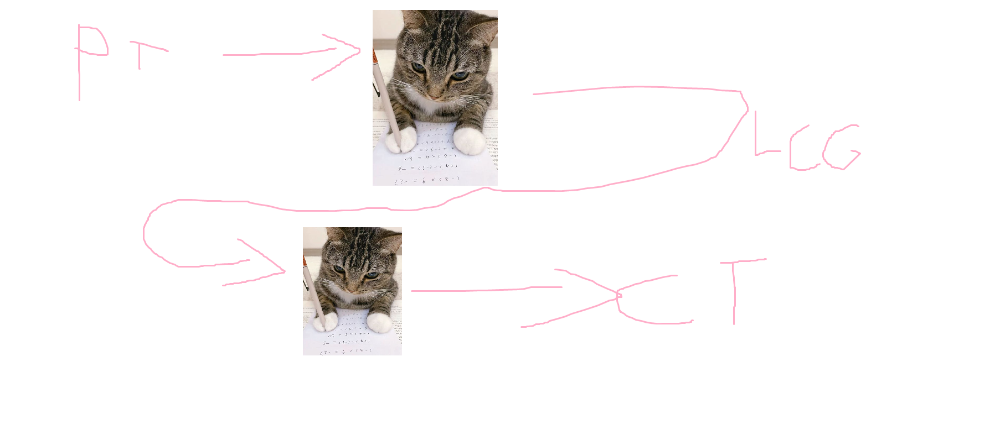

# Chall_name

Hamoor's Notes

## Description:

Note: My solve script takes about 6 minutes to run (:

## Author:

هامور الرشيد

## Brief:

Brute force CBC decrypt to find the first 3 outputs of the LCG, use them to find a, c you have m from the length of the file.

construct the LCG to find the rest of the CBC chaining

## Flag:

CSCCTF{I_spent_more_time_on_the_PDF_than_the_Challenge}
