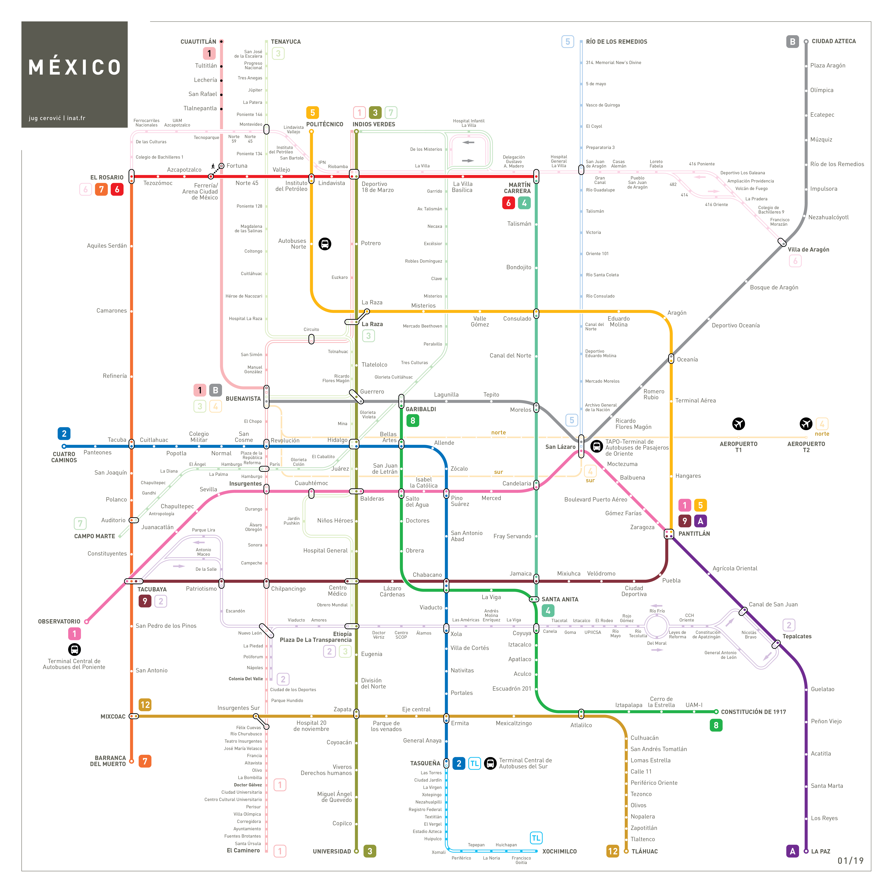

1. Reverse search the image and to find the original. Enough digging in the matching images will lead you to mentions of "CDMX Metro", or the metro of Mexico City.

    

2. Looking up the metro map of Mexico City, you should match the colors of the lines to the colors of the metro lines in the image. This will give you the order of the lines.

3. At this point you can try all the stations on line 2, but if you look closely to the text behind batman, you can see that it is made up of two words. This should limit your search to a few stations. The correct one is "Bellas Artes".

`CSCCTF{19.436,-99.142}`